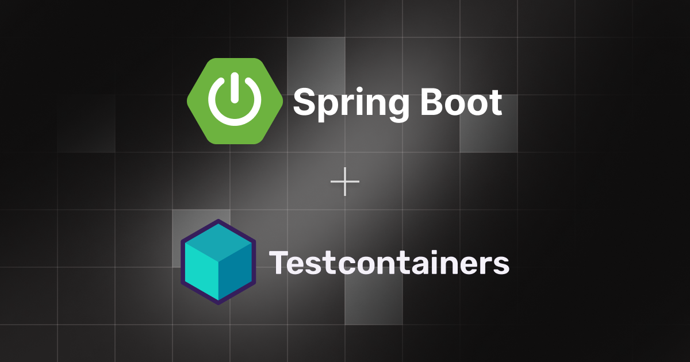

# Exemplo de uso do Testcontainer


O Testcontainer é uma ferramenta que permite executar containers Docker de maneira programática em sua aplicação, facilitando a escrita de testes de integração.

Além disso, é possível utilizar o Testcontainer para iniciar o ambiente de desenvolvimento, eliminando a necessidade de instalar as dependências do projeto manualmente.

Este repositório é um exemplo de utilização do Testcontainer com Spring Boot e MongoDB.

Leia o meu post sobre esse tema: [Testes de integração com Spring Boot e TestContainers](https://www.leoferreira.dev/blog/testes-integração-com-spring-boot-e-testcontainers?utm_source=github&utm_medium=repo&utm_campaign=blog&utm_id=linkdin-posts&utm_term=testes-integra%C3%A7%C3%A3o-com-spring-boot-e-testcontainers)
---------------------------------------------------------------------------------------------

## Requisitos

- Docker
- Java 17

## Ambiente de dev

1. Faça o clone do repositório

    ```bash
    git clone https://github.com/leoferreiralima/testcontainers-example.git
    ```
2. Rode os Tests ou suba o ambiente de dev
    ```bash
    ./gradlew test
    ```
    ou

   ```bash
    ./gradlew bootTestRun
    ```
